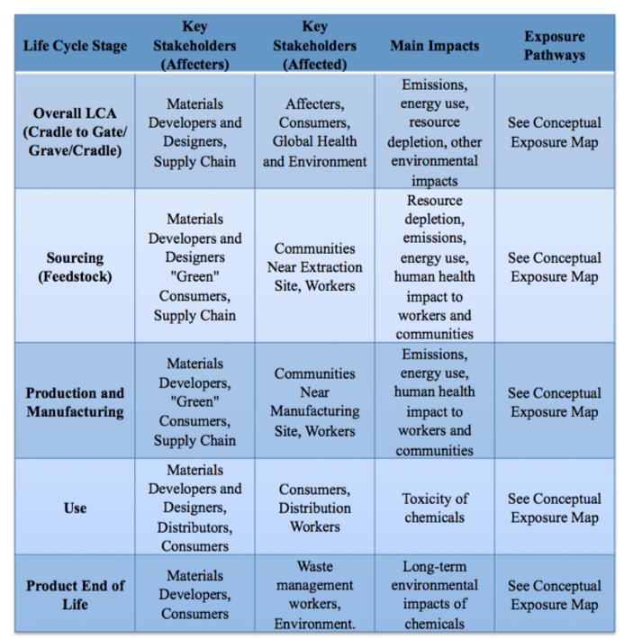

# Resource 4: Stakeholder Considerations & Social Impacts

## Stakeholder Assessment

### Life Cycle Considerations 
Stakeholders can be defined as “those groups who can affect or are affected by the achievement of an organization’s purpose” Stakeholders can be divided into those who are affected by the material impacts (affected), and those who affect the development of that material (affecters) (8).

This can also be viewed as a 2x2 interest versus power grid such as the one below.  Stakeholder considerations range from the most immediate, workers to regional  to the global environment. The stakeholder impact map has overlap with the exposure mapping since exposure to chemicals is important to health and safety.

Power versus Interest Grid

### Tools & Resources

Use this chart to think through who might be affected and how at each stage of your product's life cycle 

Example chart developed to consider stakeholder exposures and impacts across the life cycle of a product
