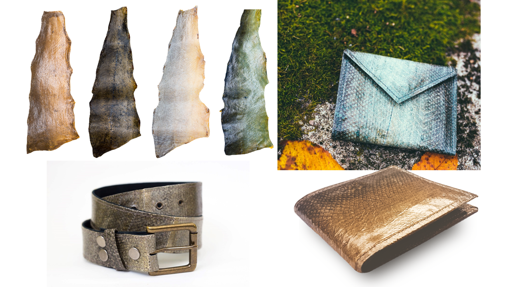

# Feedstock Concerns

## Goal: 
To use base feedstock that preserves natural capital (maximizes resource efficiency) while providing performance and other sustainability benefits.

## Introduction to Feedstock Concerns
According to the [World Forum on Natural Capital](https://naturalcapitalforum.com/about/), natural capital is defined as the world’s stocks of natural assets that include geology, soil, air, water and all living things. Humans depend on natural capital for a wide range of ecosystem services. Poorly managed natural capital can destroy productivity and resilience, making it more difficult for humans and other species to sustain themselves ([6](https://naturalcapitalforum.com/about/)). To meet the design principle of Maximizing Resource Efficiency, it is necessary to preserve natural capital. The choice of feedstock can have significant impacts on natural capital.

Best practices strive to decouple feedstock selection from negative impacts on natural capital such as natural resource depletion and negative impacts on communities from raw material extraction. Some feedstock is not renewable but it may be abundant. 

Other feedstock such as certain metals may be rare and metals are of course not renewable. The use of renewable feedstock will not be sustainable if degradation or consumption of it occurs at a rate that is faster than the resource can regenerate.  If a depleting feedstock is used, then care should be taken to ensure that the materials will be recycled once no longer needed.

Products based on depleting natural resources or renewable resources that degrade land or compete with food production do not preserve natural capital and do not support sustainable product design. Feedstock derived from easily recycled materials, readily available wastes such as agricultural wastes or rapidly renewable and abundant biomass like algae or seaweed may help to preserve natural capital. For some renewable raw materials/feedstock, certification programs are available to ensure that the resources are responsibly managed for environmental, social and economic benefits. 

At a minimum, define the primary feedstock used to generate the chemical, material or product. In general, rapidly renewable or waste derived feedstock results in supply chain benefits. Evaluations can be enhanced by 'designing with the end in mind'. Think about whether or not there is a relationship between feedstock and waste management options.  Can they be linked to create both supply and demand for materials that cycle in a sustainably managed material economy.

## Example
### Examples of renewable feedstocks

[Image source: Department of Energy](https://www.energy.gov/eere/bioenergy/biomass-feedstocks/)

### TidalVision USA uses waste from sustainable fisheries
[TidalVision USA](https://tidalvisionusa.com/) is an early stage company based in Bellingham, WA that uses fishery wastes to make high value products. They refer to this as ‘upcycling’ because a low value waste material is used to make a high value product.  Their goal is to add value to the sustainable fishing and crabbing industries by generating value from the waste.  The company treats salmon skins to make salmon leather using benign chemical process and makes wallets, purses, and other high value products.  They also process crab waste to make a variety of useful products based on chitosan that is derived from the chitin in the shell wastes.  The founder of the company is an Alaskan fisherman who was disturbed by the scale of fisheries byproduct wastes and became a social and environmental entrepreneur.  He uses wastes from sustainable fisheries to add value to an industry that strives to operate sustainably.

