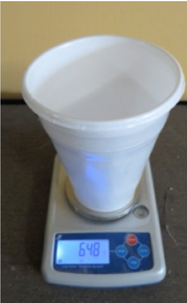
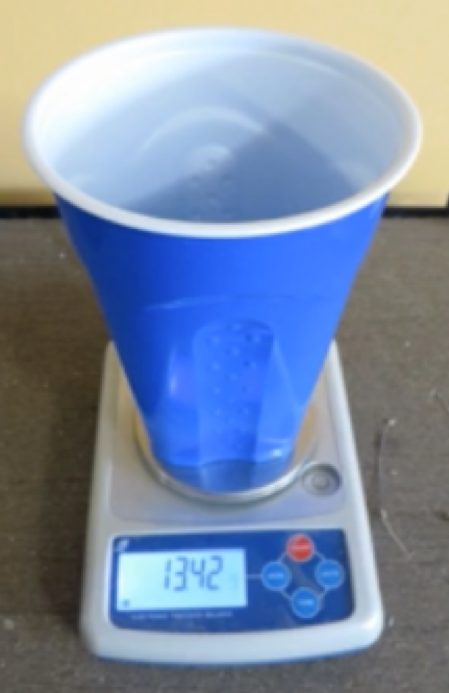

# Production & Manufacturing

### Goal
To produce and manufacture products in a way that maximizes resource efficiency and eliminates toxic chemicals and pollution in order to protect workers and those who live around the production or manufacturing facility who may be exposed to chemicals and other emissions from production and manufacturing.

Chemicals used in production and manufacturing such as mold release agents or cleaning agents, even in not intentionally added to a product, may still end up in the product as residuals.

Strategies for meeting the goal require knowing the chemicals used and produced and understanding their inherent hazards and potential exposure pathways. Exposure levels do not need to be measured in most cases. Rather, qualitative exposure assessment may be based on the presence of a chemical in a form that can be inhaled, ingested or absorbed through the skin.

Maximizing resource efficiency requires measuring the use of energy, water, materials used and the generation of waste in order to benchmark a product against other products or to guide efficiency improvements.

For a comprehensive sustainability assessment, manufacturing must consider economic, social and environmental impacts.  This workbook focuses on Design Principles for Sustainable Green Chemistry and Engineering, an important part of sustainability assessment.

[Image Source: OECD Sustainable Manufacturing Toolkit]("https://www.oecd.org/innovation/green/toolkit/aboutsustainablemanufacturingandthetoolkit.htm")

## Examples

Grow Plastics developed a way to produce food packaging such as meat trays made from corn-based polylactic acid (PLA).  These trays do not require any chemical additives, a big concern for some plastics and other packaging materials where the chemical additives can leach into food. Their PLA trays are made with a unique sandwich panel construction that achieves the desired performance properties but uses less material. Grow Plastics has found that their products produce only 1/4 the CO2 from materials manufacture compared to conventional plastics. Their lighter-weight biobased products are designed to reduce consumption of materials to preserve natural capital while providing a product with improved performance.

 

[Learn more about Grow Plastics]("http://growplastics.com/") 
[Image Source: Grow Plastics]("http://growplastics.com/technology.html") 
[Image Source: NatureWorks]("https://www.natureworksllc.com/What-is-Ingeo/How-Ingeo-is-Made")
