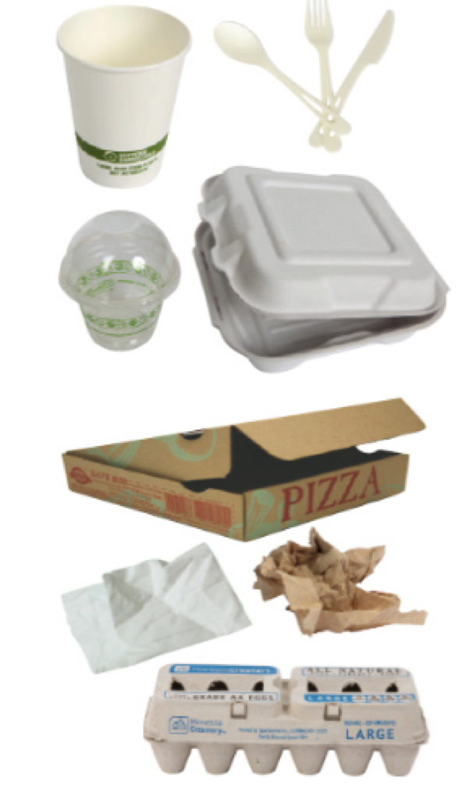

# Sustainable Product Design for the Use Phase

## Goal

To minimize or eliminate hazards in products and pollution during the use stage of the product's life cycle. To maximize resource efficiency by preventing the generation of waste.

## Strategies

-   Use low hazard chemicals in materials and products
-   Use especially low hazard chemicals in applications where high exposure is likely to occur
-   Make products that are intended to last
-   Make products from materials that are readily recovered and recycled after use
-   Make sure that the user knows what to do with the product after use

## Examples

### 3D printing

3D printing or additive manufacturing is a technology that continues to advance rapidly. It is used in schools, a diversity of industries and in homes. One aspect of 3D printing that is unique at this time is that it moves elements of manufacturing from the factory to the home or shop. Decentralizing manufacturing makes it harder to oversee the use and generation of hazardous chemicals and makes the use of materials that are safe and benign even more imperative. When filament made from the plastic ABS is heated, melted and extruded in a 3D printer, it can create volatile compounds and nanoparticles that are harmful to human health. Corn based PLA filament is much safer than ABS when used as filament in additive manufacturing, but PLA can also produce harmful emissions if heated at a high enough temperature.

Image source: NASA

### Food take-out containers

Some fiber-based food take-out containers contain highly fluorinated organic chemical additives to prevent wet or oily food from leaking through the container. However, it's nearly impossible to tell just by looking at a product, like the ones pictured below whether or not they contain such chemicals. In the case of food packaging materials, toxic, extremely persistent, environmentally-harmful chemicals are of particular concern because they come in contact with our food. This is why it's so critical to design products from the outset to be functional during use without the need for hazardous additives.

Image Source: City of Plymouth Minnesota

Which of these compostable items probably contains fluorinated additives? A chemical inventory must be completed in order to know.

With regards to single-use food contact materials, the Center for Environmental Health tested plates, bowls, clamshells, and multi-compartment food trays for total fluorine content, which would indicate the use of highly fluorinated addititives, and the resulting [report is available on-line](https://www.ceh.org/wp-content/uploads/CEH-Disposable-Foodware-Report-final-1.31.pdf).
