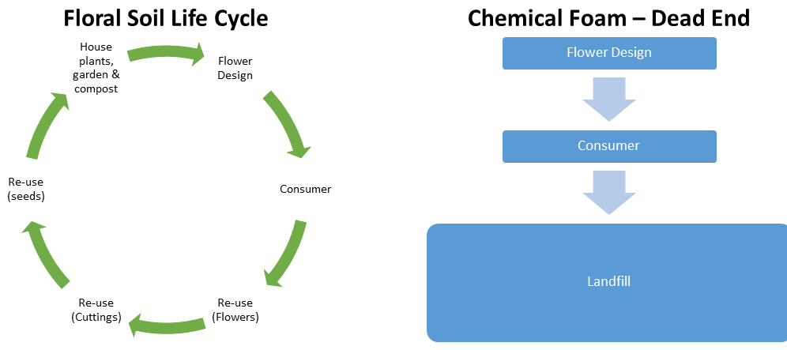

# End of Life Considerations

## Goal
To maximize resource efficiency by eliminating waste, hazards and pollution associated with the fate of chemicals, materials and products after use. Waste may be mitigated by designing a product for longevity and durability or for reuse and recycling.

End of life hazards include chemical hazards but also physical hazards from litter. A viable waste management pathway for a product once it is no longer needed should be part of the initial product design. In addition, consumers should have clear information on how to best ensure proper management and value recovery.

‘Cradle to Cradle’ thinking calls for deciding up front whether the materials in the product are intended to be ‘biological nutrients’ within a ‘biological cycle’ or ‘technical nutrients’ within a ‘technical cycle’ (or both). If a chemical or material is intended to be a biological nutrient, its fate should result in complete and benign biodegradation in its likely waste pathway, whether that is wastewater treatment, compost, etc. If it is intended to be a technical nutrient, it should be reused or recycled in either a widely available recycling system or in a system managed by the product manufacturer to ensure recovery and proper management. Green Blue Institute has developed the How2Recycle Labeling program to assist with optimizing proper end of life management of packaging materials.

The chemicals and materials in a product can enhance or diminish the value of recycled materials.  They can also cause problems different waste management pathways.  For example, if a toxic and persistent chemical is included in a commercially compostable plastic, the plastic may biodegrade, but the additive will not.  It will stick around and contaminate the compost and make it less valuable.

[Learn more about Cradle to Cradle design.](https://us.macmillan.com/cradletocradle/williammcdonough/9780865475878/)

Consider how your product will have the least impact on human health and the environment after use by striving to be near the top of the waste hierarchy. While there are exceptions to the waste hierarchy, the idea of first preventing waste, then recovering the most material value with the least negative life cycle impacts still holds.

## Possible End of Life Pathways for Products After Use
Waste mismanagement and littering are forms of what is called 'leakage' to the environment.  It is an all too frequent and very undesirable waste pathway. Estimate how likely it is that leakage to the environment will occur. Using global statistics based on types of waste found in the environment is recommended. Estimates based on regional differences are relevant.  For example, some of the more frequently found litter includes cigarette butts and plastic bags.

- Leakage (improper management, litter)
- Landfill
- Incineration with no energy recovery
- Incineration with energy recovery
- Recycling (primary, secondary, tertiary or quaternary)
- Compost (commercial)
- Compost (backyard)
- Other biodegradation (aquatic (fresh, marine), aerobic, anaerobic)

## Examples

### Example 1: Design for Multiple EOL Pathways
Floral Soil Solutions designed the Floral Soil product for multiple end of life pathways.  First of all, the product is designed for reuse multiple times for holding cut flowers.  It can also be used to grow plant plants starting with cuttings and even seeds.  After multiple uses, if the product is truly spent, it can be added to enhance soil in houseplants, in a garden or in compost.

#### Standards
- If the product is intended for commercial composting, has it been tested using standard test methods?  For an example in packaging products, see the harmonized European standard EN 13432 and EN 14995.
- If the product after use is appropriate for home compostability, has it been tested using standards such as the DIN CERTCO (Germany) and Vinçotte (Belgium)?
- Does the product degrade in the marine environment? Has it been tested using standards such as ASTM D7991?
- Have chemical products or chemical constituents in materials or product been tested for degradation in water, soil and sediment under aerobic and anaerobic conditions? Standard test methods developed by the US EPA or OECD are typically included in chemical hazard assessment methods.

### Example 2: Design for Value Recovery
A good model for integrating product design with material recovery is the RecyClass Tool developed by Plastics Recyclers Europe.  RecyClass guides the choice of plastic used in packaging and promotes recycling. It addresses the presence of incompatibilities that affect the efficiency of recycling. Plastics that are easy to identify and to separate from the rest of the product, and for which there is an established Plastics Recyclers Europe (PRE) recycling stream score better. RecyClass is limited to a small variety of plastics such as PET-bottles, PE-LD and HD, polyolefin tubs and trays, PVC from the building sector and some technical plastics. While limited in scope, the tool is a good model for how product design considerations can be linked to material selection and to material recycling options.

### Example 3: GreenBlue's How2Recycle
Green Blue Institute has developed the How2Recycle Program to provide structured guidance for how to communicate information to customers on how to manage a product's packaging once it is ready to become waste.

[Image Source: GreenBlue]("http://greenblue.org/work/how2recycle/") 
[Learn more about the Green Blue Institute's How2Recycle Program]("http://greenblue.org/work/how2recycle/")